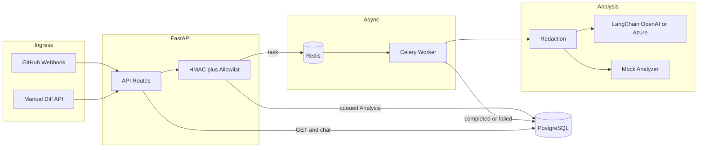

# Code Risk POC

FastAPI + Celery service that takes a code change (GitHub webhook or manual diff),
redacts obvious secrets, runs an async risk pass (LangChain or a local mock), and
stores findings in Postgres. Devs can chat against a finished analysis.

## What it does

- GitHub `push` / `pull_request` webhooks (HMAC verified)
- Manual diff submit API
- Celery worker + Redis queue
- Regex redaction before LLM calls
- LangChain structured output (`AnalysisReport`) for OpenAI / Azure OpenAI
- Deterministic mock analyzer when you don't want to hit an API
- Chat grounded on the stored redacted diff + report
- Repo allowlist, diff length cap
- Compose stack: API, worker, Postgres, Redis



## Layout

```text
app/
  api/routes.py
  core/config.py, security.py
  db/models.py, session.py
  schemas/analysis.py
  services/github.py, llm.py, mock_analyzer.py, redaction.py
  workers/celery_app.py, tasks.py
  main.py
tests/
sample_payloads/
Dockerfile
docker-compose.yml
Makefile
requirements.txt
.env.example
```

