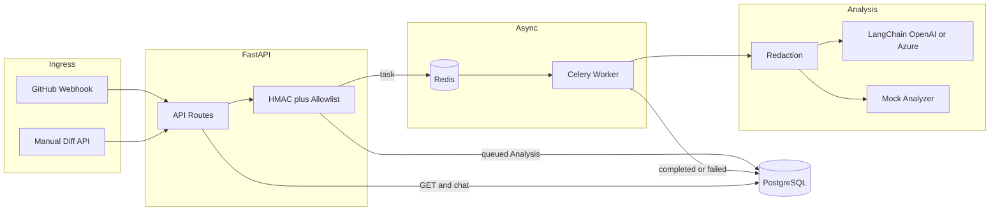

# Code Risk POC

FastAPI + Celery service that takes a code change (GitHub webhook or manual diff),
redacts obvious secrets, runs an async risk pass (LangChain or a local mock), and
stores findings in Postgres. Devs can chat against a finished analysis.

## What it does

- GitHub `push` / `pull_request` webhooks (HMAC verified)
- Manual diff submit API
- Celery worker + Redis queue
- Regex redaction before LLM calls
- LangChain structured output (`AnalysisReport`) for OpenAI / Azure OpenAI
- Deterministic mock analyzer when you don't want to hit an API
- Chat grounded on the stored redacted diff + report
- Repo allowlist, diff length cap
- Compose stack: API, worker, Postgres, Redis



## Layout

```text
app/
  api/routes.py
  core/config.py, security.py
  db/models.py, session.py
  schemas/analysis.py
  services/github.py, llm.py, mock_analyzer.py, redaction.py
  workers/celery_app.py, tasks.py
  main.py
tests/
sample_payloads/
Dockerfile
docker-compose.yml
Makefile
requirements.txt
.env.example
```

## Setup

Needs Python 3.12+. Docker Compose is the easy path.

```bash
python -m venv .venv

# Windows
.\.venv\Scripts\Activate.ps1

# macOS / Linux
source .venv/bin/activate

pip install -r requirements.txt
cp .env.example .env
```

Without Compose you still need working `DATABASE_URL` and `REDIS_URL` in `.env`.

### Docker

```bash
cp .env.example .env
docker compose up --build
```

Compose loads `.env` for app settings. `DATABASE_URL` / `REDIS_URL` are overridden
in `docker-compose.yml` so containers talk to the `db` and `redis` services.

| Service | Port |
|---------|------|
| API | 8000 |
| Postgres | 5432 |
| Redis | 6379 |

```bash
docker compose logs -f api worker
docker compose down
```

Makefile: `make up`, `make down`, `make logs`, `make test`, `make verify`, `make config`.

## Quick curl

```bash
curl -s -X POST http://localhost:8000/api/v1/analyses/manual \
  -H "Content-Type: application/json" \
  -d "{
    \"repository\": \"bank/payments-api\",
    \"commit_sha\": \"abc123\",
    \"branch\": \"feature/payment-logging\",
    \"diff\": \"diff --git a/app/payment.py b/app/payment.py\\n+++ b/app/payment.py\\n+query = f\\\"SELECT * FROM accounts WHERE id = {account_id}\\\"\\n\"
  }"
```

```bash
curl -s http://localhost:8000/api/v1/analyses/<analysis_id>
```

```bash
curl -s -X POST http://localhost:8000/api/v1/analyses/<analysis_id>/chat \
  -H "Content-Type: application/json" \
  -d "{\"question\": \"Could this change expose customer data?\"}"
```

## GitHub webhook

1. Set `GITHUB_WEBHOOK_SECRET`.
2. Point the repo webhook at `https://<host>/api/v1/webhooks/github`
   - content type JSON
   - same secret
   - events: pushes + pull requests
3. Optional: `ALLOWED_REPOSITORIES=org/repo,org/other`

Webhook payloads usually don't include full patches. We store a metadata-only
summary and don't invent a diff. There's a `DiffFetcher` stub for a future
read-only GitHub App. No GitHub token needed for this POC.

Samples: [`sample_payloads/push.json`](sample_payloads/push.json),
[`sample_payloads/pull_request.json`](sample_payloads/pull_request.json).

### Sign a test payload

```python
import hashlib, hmac, pathlib

secret = b"change-this-secret"
body = pathlib.Path("sample_payloads/push.json").read_bytes()
print("sha256=" + hmac.new(secret, body, hashlib.sha256).hexdigest())
```

```bash
curl -s -X POST http://localhost:8000/api/v1/webhooks/github \
  -H "Content-Type: application/json" \
  -H "X-GitHub-Event: push" \
  -H "X-Hub-Signature-256: $SIGNATURE" \
  --data-binary @sample_payloads/push.json
```

Bad/missing sig → 401. Unsupported event → 422.

## LLM providers

```env
# default — no key needed
LLM_PROVIDER=mock
```

```env
LLM_PROVIDER=openai
OPENAI_API_KEY=sk-...
OPENAI_MODEL=gpt-4.1-mini
```

```env
LLM_PROVIDER=azure_openai
AZURE_OPENAI_API_KEY=...
AZURE_OPENAI_ENDPOINT=https://<resource>.openai.azure.com/
AZURE_OPENAI_API_VERSION=2024-10-21
AZURE_OPENAI_DEPLOYMENT=<deployment-name>
```

Temp is locked to 0. Missing creds for openai/azure fail at settings load.

## API

| Method | Path | Notes |
|--------|------|-------|
| GET | `/health` | liveness |
| POST | `/api/v1/analyses/manual` | queue manual diff → 202 |
| POST | `/api/v1/webhooks/github` | webhook intake → 202 |
| GET | `/api/v1/analyses/{id}` | status + report |
| POST | `/api/v1/analyses/{id}/chat` | chat (completed only) |

Status flow: `queued` → `running` → `completed` | `failed`.

## Tests

In-memory SQLite + Celery eager. No network, no live LLM, no real Postgres/Redis.

```bash
pip install -r requirements.txt
pytest -q
# or
make verify
```

`make verify` = pytest + compileall + import smoke. Expect **27 passed**.

Live OpenAI/Azure paths are wired but not covered offline.

## Security notes (POC)

- HMAC SHA-256 on webhooks (constant-time compare)
- Repo allowlist (empty = allow all, local DX only)
- Diff truncation via `MAX_DIFF_CHARS`
- Regex redaction before LLM — not DLP
- No auto-merge / auto-approve
- `requires_human_review` always true
- Non-root container user, Celery late acks + prefetch 1

## Limitations

- Webhooks are often metadata-only
- Mock analyzer is a handful of heuristics
- `create_all` at startup — fine for POC, not for prod
- No API auth, no replay protection, no idempotency keys
- Not production-ready for a bank

## If this ever went further

Auth (Entra/OAuth), RBAC, Key Vault, private networking, managed Postgres/Redis,
Alembic migrations, real GitHub App diff fetch, SAST/SCA alongside, audit logs,
otel, rate limits, DLP on LLM egress, retention policy, threat model.

## License

MIT
